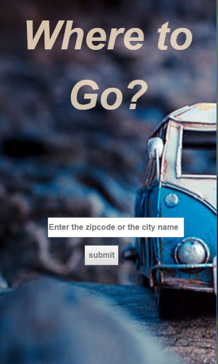
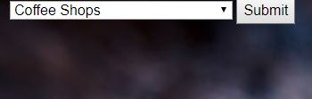
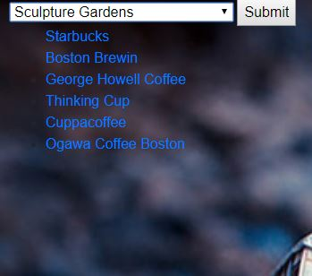
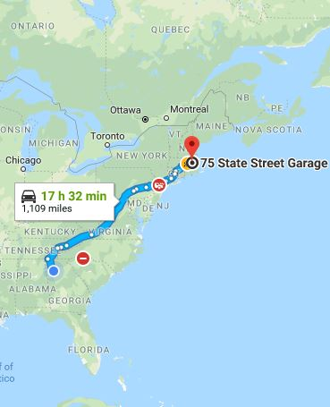

# Travel-app
---

## What It is

## Technologies Used
* Node.js
* Express
* Handlebars.js
* PostgreSQL
* Google Maps Geocoding API
* Foursquare API
* Google Maps API

## Strategy

### Minimum Viable Product

## Site Wakethrough

### Homepage

### Selection Page

#### List of selections Page

#### User can click on one selection and get redirected to a google maps corresponding to the latitude and longitude for that venue

### Direction page

#### A Google Maps Page 

##### Click on directions and it will redirect to a google maps that uses the selected venues address as endpoint for the travel destination.

###### Page with the direction from a selected start location(as current location) and the endpoint; 
Map displayed with the driving directions.

## Challenges
